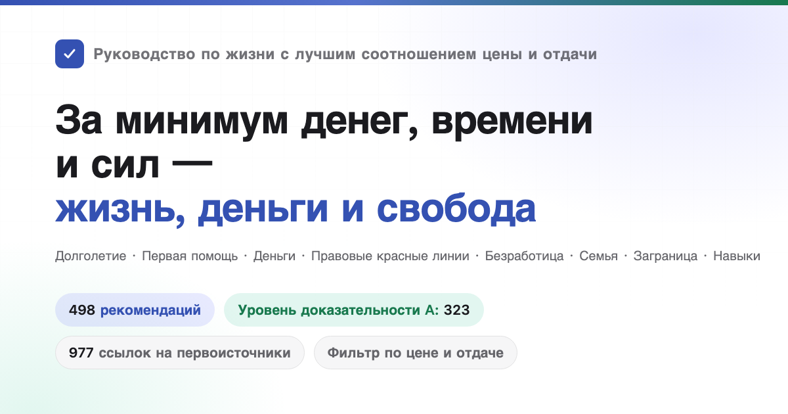

<div align="center">



# Руководство по жизни с лучшим соотношением цены и отдачи

Охватывает долголетие и профилактику болезней, несчастные случаи и первую помощь, экономию и управление деньгами, защиту от мошенничества и правовые красные линии, выживание при безработице, риски предпринимательства, создание платформ и соответствие требованиям, отношения, брак и рождение детей, поездки за границу и навыки.<br>
498 рекомендаций, в каждой указано, что вы тратите, что получаете взамен и насколько надёжны доказательства; источники — только журнальные статьи и официальные документы.

[](https://qqrxxz.github.io/HowToLiveBetter/)
[](#оглавление)
[](#уровни-доказательности)
[](docs/журнал-проверки/)
[](LICENSE)

**[Открыть страницу онлайн-поиска](https://qqrxxz.github.io/HowToLiveBetter/)** · [Оглавление](#оглавление) · [Глоссарий](#как-читать-цифры-глоссарий) · [Журнал проверки](docs/журнал-проверки/) · [Выгоден ли брак (статья)](docs/выгоден-ли-брак.md) · [Домашний аварийный набор (статья)](docs/домашний-аварийный-набор.md) · [Останавливаться ли, если с незнакомцем случилась беда (статья)](docs/останавливаться-ли-если-с-незнакомцем-беда.md) · [Какие лицензии нужны платформе (статья)](docs/какие-лицензии-нужны-платформе.md)

</div>

---

## На какие вопросы отвечает эта книга

| Вопрос | Где смотреть |
| --- | --- |
| Что можно делать почти бесплатно, заметно снижая вероятность ранней смерти? | [1. Не умереть рано](book/01-не-умереть-рано.md) |
| Насколько на самом деле сокращают жизнь курение, алкоголь, сидячий образ жизни и недосып? | [2. Не умирать медленно](book/02-не-умирать-медленно.md) |
| Каждый день не хватает сил, постоянно отвлекают — что изменить? | [3. Не тратить силы впустую](book/03-не-тратить-силы-впустую.md) |
| Куда уходит время и как реже делать то, что ничего не даёт? | [4. Не тратить время впустую](book/04-не-тратить-время-впустую.md) |
| Как хранить накопления, чтобы их не съели проценты, комиссии и мошенники? | [5. Не тратить деньги впустую](book/05-не-тратить-деньги-впустую.md) |
| Какие БАДы, пакеты обследований и «налоги на глупость» можно просто не покупать? | [6. Список наоборот](book/06-список-наоборот.md) |
| Потеряли работу, не платят зарплату, нет денег — что можно получить и куда обратиться? | [7. Как жить, когда нет денег](book/07-как-жить-без-денег.md) |
| Выкуп за невесту, добрачная квартира, крупные переводы во время отношений — чьё это по закону? | [8. Правовая и имущественная безопасность](book/08-не-подставить-себя.md) |
| На вас подали заявление, на вас написали донос с выдуманными фактами — что делать первым делом и можно ли потом привлечь к ответственности и получить компенсацию? | [8. Правовая и имущественная безопасность](book/08-не-подставить-себя.md) |
| Какие «подработки» и мелкие услуги делают обычного человека обвиняемым по уголовному делу? | [9. Правовые красные линии, на которые легко наступить обычному человеку](book/09-правовые-красные-линии-для-обычных-людей.md) |
| Ухаживать сразу за многими или добиваться одного человека, получатся ли отношения на расстоянии, что взять с собой для регистрации брака? | [10. Выгодны ли отношения и брак](book/10-выгодны-ли-отношения-и-брак.md) |
| За какой код и какие заказы можно получить срок? | [11. Красные линии, на которые легко наступить программистам и технарям](book/11-красные-линии-для-программистов-и-технарей.md) |
| Что важнее всего продумать, прежде чем брать в долг на открытие магазина или компании? | [12. Предпринимательство и бизнес](book/12-предпринимательство-и-бизнес.md) |
| Человек упал и не дышит, сильное кровотечение, пожар, заблудились — что делать сначала? | [13. Экстренные ситуации: что делать в первую очередь](book/13-экстренные-ситуации.md) |
| Взломали аккаунт, потеряли телефон — что делать первым делом? | [14. Безопасность аккаунтов и информации](book/14-безопасность-аккаунтов-и-информации.md) |
| Удержали залог, арендодатель выгоняет, лопнула компания долгосрочной аренды — что делать? | [15. Аренда и покупка жилья](book/15-аренда-и-покупка-жилья.md) |
| После диагноза хронической болезни — как вести её долгие годы и тратить меньше? | [16. Как жить с хронической болезнью](book/16-как-жить-с-хронической-болезнью.md) |
| Как заранее устроить опеку, завещание и деньги пожилых родственников? | [17. Пожилые в семье](book/17-пожилые-в-семье.md) |
| Что можно получить при рождении ребёнка и сколько времени и денег это отнимет? | [18. Выгодно ли растить детей](book/18-выгодно-ли-растить-детей.md) |
| Как считать сверхурочные и ежегодный отпуск, сколько компенсации положено при сокращении, как признать травму на работе и получить деньги? | [19. Работа, увольнение и производственные травмы](book/19-работа-увольнение-и-производственная-травма.md) |
| Ребёнок только родился — какие несколько дел самые важные? | [20. Уход за новорождённым](book/20-уход-за-новорождённым.md) |
| В какие страны сейчас лучше не ехать и до какой степени помогут посольство и консульство, если что-то случится? | [21. Поездки за границу и безопасность за рубежом](book/21-поездки-за-границу-и-безопасность.md) |
| Как не попасть впросак в караоке, интернет-кафе и квест-комнатах и что лучше всего помогает при сильном стрессе? | [22. Как расслабиться: развлекательные заведения и снятие стресса](book/22-как-расслабиться.md) |
| Учиться на сварщика, учить английский, получать сертификаты — что действительно окупается? | [23. Каким навыкам выгодно учиться](book/23-каким-навыкам-выгодно-учиться.md) |
| Сколько стоит разница между лечением одной и той же болезни в общественном центре и в больнице третьего уровня? | [24. Лечение: как тратить меньше денег и не блуждать](book/24-лечение.md) |
| Тяжело травмированный человек добрался до больницы — вставать в очередь в регистратуру или идти к стойке сортировки приёмного отделения? Нужно ли после лечения проходить экспертизу инвалидности и оформлять удостоверение инвалида? | [24. Лечение: как тратить меньше денег и не блуждать](book/24-лечение.md) |
| Умер член семьи — что делать в первые часы, какие деньги можно вернуть, какие платежи можно не вносить? | [25. Что оформлять после смерти близкого](book/25-что-оформлять-после-смерти-близкого.md) |
| Сделать сайт или платформу и принимать деньги — какие нужны разрешения и где размещать сервер? | [26. Сделать сайт или платформу](book/26-сделать-сайт-или-платформу.md) |
| Беременность, скоро роды — что и когда делать, какие документы оформить до выписки? | [27. Беременность и роды](book/27-беременность-и-роды.md) |
| Хочется похудеть и стать красивее — какие способы разрушают здоровье? | [28. Не губить здоровье ради внешности](book/28-не-губить-здоровье-ради-внешности.md) |
| Умер близкий, сократили, поставили тяжёлый диагноз — что важнее всего в первые месяцы? | [29. После тяжёлого удара](book/29-после-тяжёлого-удара.md) |
| Ребёнок пошёл в школу — какие вопросы физического и психического здоровья нельзя откладывать до конца экзаменов? | [30. Дети школьного возраста](book/30-дети-школьного-возраста.md) |
| Какие пути есть после восемнадцати, кроме учёбы и работы, и какой порог входа у каждого? | [31. Какие пути есть после восемнадцати](book/31-какие-пути-есть-после-восемнадцати.md) |

## Как читать

- **Хотите отфильтровать по условиям**: откройте [страницу онлайн-поиска](https://qqrxxz.github.io/HowToLiveBetter/) — там можно комбинировать ключевые слова, разделы, уровень доказательности и три измерения стоимости: «тратить ли деньги, сколько времени, нужна ли сила воли». Данные читаются прямо из текста в book/, поэтому изменение текста сразу меняет страницу поиска.
- **Хотите читать по порядку**: пункты внутри каждого раздела упорядочены по соотношению цены и отдачи от высокого к низкому, достаточно начать с первых пунктов каждого раздела.
- **Непонятны все эти цифры**: в каждом пункте есть строка «Простыми словами», где отношения рисков и доверительные интервалы из поля «Выгода» переведены в житейские формулировки вроде «вероятность умереть за тот же период ниже примерно на 20%» или «административный арест на несколько суток, штраф такой-то», только на основе фактов из оригинала, без новых цифр. Чтобы принять решение, достаточно этой строки; в поле «Выгода» сохранены все исходные цифры и доверительные интервалы, чтобы вы могли проверить сами.
- **Хотите только самые надёжные выводы**: отметьте на странице поиска уровень доказательности A — останутся 323 пункта с конкретными цифрами из метаанализов или крупных исследований.
- **Хотите только то, что больше всего стоит делать**: отметьте соотношение цены и отдачи «очень высокое» — получите 85 пунктов, которые не требуют ни денег, ни времени, ни силы воли, а выгода у них в самой большой категории. Добавьте ещё фильтр «Что получаете» — и это будет список приоритетов для этого мерила.
- **Не пугайтесь заголовков разделов, начинающихся с «Не»**: заголовок раздела описывает результат, которого раздел помогает избежать (не умереть рано, не тратить время впустую), а не означает, что каждый пункт в нём — запрет. Действие задаёт заголовок пункта: он всегда начинается с глагола и сам говорит, «что делать» или «чего не делать», — в одном разделе встречается и то и другое. Например, в разделе 4 есть и «Превратить „собираюсь сделать“ в „во сколько, где и при каком событии что делаю“», и «Не смотреть телевизор и ленту новостей». Читайте по заголовкам пунктов, не переносите на них тон заголовка раздела.

Каждая рекомендация выглядит так:

```markdown
### 5. Заменить дома поваренную соль на соль с пониженным содержанием натрия (калийную соль)
- Стоимость: пачка дороже на несколько юаней
- Простыми словами: в рандомизированном исследовании на двадцати тысячах человек у тех, кто заменил дома соль на соль с пониженным содержанием натрия, вероятность умереть за пять лет была ниже примерно на 12%, инсульта — примерно на 14%. Это результат случайного распределения по группам, он надёжнее обычных наблюдательных данных.
- Выгода: инсульт −14%, сердечно-сосудистые события −13%, общая смертность −12%
- Уровень доказательности: A
- Источники: Neal B, et al. (2021). NEJM. https://doi.org/10.1056/NEJMoa2105675
- Примечание: Спорно. Людям с почечной недостаточностью и принимающим калийсберегающие диуретики не использовать. Кроме того, экологическое исследование по 181 стране обнаружило, что в странах с более высоким потреблением натрия ожидаемая продолжительность жизни, наоборот, выше, а общая смертность, наоборот, ниже (β=−131 случай на грамм суточного потребления натрия, R²=0,60, P<0,001), и авторы на этом основании возражают против того, чтобы считать натрий виновником сокращения жизни; но экологическое исследование сравнивает страны, а не людей: в богатых странах и соль едят больше, и живут дольше, и исключить экономический уровень как конфаундер нельзя, поэтому уровень доказательности ниже, чем у упомянутого рандомизированного контролируемого исследования. Источник: Messerli FH, Hofstetter L, Syrogiannouli L, et al. (2021). Sodium intake, life expectancy, and all-cause mortality. European Heart Journal, 42(21), 2103-2112. <https://doi.org/10.1093/eurheartj/ehaa947>
```

## Четыре ресурса

Это руководство оптимизирует не только продолжительность жизни, а четыре ресурса:

- **Продолжительность жизни**: жить дольше, реже умирать от того, чего можно было избежать
- **Время и силы**: чтобы время жизни не занимали дела без отдачи, а внимание и силы каждый день меньше расходовались впустую
- **Деньги**: меньше тратить зря, вкладывать деньги туда, где отдача гарантирована
- **Личная свобода**: не попасть под административный арест или в следственный изолятор из-за того, что не знали какой-то красной линии

Каждая рекомендация отвечает на два вопроса: что вы тратите (деньги / время / силы / силу воли) и что получаете взамен (изменение общей смертности / снижение смертности от конкретной причины / экономию времени и сил / экономию денег / социальные гарантии и личную свободу). Пункты упорядочены по соотношению цены и отдачи, а не по категориям: то, что стоит почти ноль и даёт большую выгоду, стоит в самом начале.

**На чей счёт записывается выгода — зависит от уровня.** По «ожиданию того, что эта польза когда-нибудь вернётся к вам», от высокого к низкому: ① **вы сами**; ② **супруг(а) и прямые родственники** (родители, дети, бабушки и дедушки по обеим линиям, внуки и внучки по обеим линиям); ③ **друзья, коллеги и прочие родственники** — отношения взаимности, помощь может вернуться; ④ **незнакомые люди** — самый низкий уровень, но не ноль: вероятность ответной пользы мала, к тому же вы не знаете характера человека, и есть риск, что вас обвинят, оговорят или отомстят. Выгоды разных уровней не складываются; когда речь о четвёртом уровне, пользу и риски описываем вместе.

Раздел о первой помощи читайте именно так: из 38 227 случаев внебольничной остановки сердца в Китае 79,2% произошли дома, и учиться делать компрессии нужно прежде всего для того, чтобы делать их своим близким; правила вроде «увидев тонущего, не прыгайте в воду сами» или «наткнувшись на драку, не лезьте разнимать руками» сами по себе — правила самозащиты: они не дают вам превратиться из свидетеля во второго пострадавшего. Вмешиваться ли ради незнакомого человека — ваше собственное решение; пункты описывают освобождение от ответственности, действия для самозащиты и риски, но не превращают это за вас в обязательство.

Цифры смертности, цифры времени и сил, денежные цифры и правовые последствия измеряются разными мерилами и не пересчитываются друг в друга. Эти четыре ресурса соответствуют четырём вариантам «Что получаете» на странице поиска и между собой не сравниваются.

## Уровни доказательности

У каждой рекомендации указан уровень доказательности:

| Уровень | Значение |
| --- | --- |
| A | Есть количественные доказательства из метаанализов, крупных когортных исследований или РКИ, можно привести конкретные цифры (HR, RR, процент снижения) |
| B | Есть подтверждающие исследования, но эффект трудно выразить количественно, или доказательства получены на малой выборке / в одном исследовании |
| C | Опыт автора или общепринятое мнение, прямых публикаций нет |

Из 498 пунктов книги 323 имеют уровень A, 126 — уровень B, 49 — уровень C; кроме того, 45 пунктов помечены как спорные и в 39 местах стоит TODO «требует проверки». Спорные пункты уровня A/B помечаются «Спорно» с перечислением доказательств противоположной стороны. Все источники — только первоисточники (журнальные статьи с DOI или ссылкой на PubMed либо отчёты официальных организаций вроде ВОЗ, CDC, Национального бюро статистики), пересказы из вторых рук не цитируются. Неуверенные цифры помечаются «требует проверки».

## Класс соотношения цены и отдачи

Уровень доказательности отвечает на вопрос «можно ли доверять этой цифре», но не на вопрос «стоит ли это делать». Поэтому у каждого пункта отдельно указаны величина выгоды и мерило, а страница поиска сводит их с тремя видами затрат в класс соотношения цены и отдачи:

| Измерение | Значения | Как определяется |
| --- | --- | --- |
| Мерило | Жизнь / Деньги / Время и силы / Личная свобода | По тому, что этот пункт в основном даёт взамен. **Разные мерила между собой не сравниваются**: «общая смертность ниже на 12%» и «экономия 500 юаней в год» не меряются одной линейкой |
| Величина выгоды | большая / средняя / малая | По возможности механически, по порогам, из поля «Выгода» самого пункта: для жизни — относительное снижение (≥20% — большая, 10–20% — средняя, <10% или только суррогатная конечная точка — малая); для денег — сумма (десятки тысяч юаней — большая, от сотен до тысяч — средняя, десятки юаней — малая); для личной свободы — последствия (избежать уголовной ответственности — большая, избежать административного ареста или административного наказания — средняя, избежать гражданского спора — малая); для времени и сил — объём экономии (часы в день — большая, часы в неделю — средняя, разово — малая) |
| Соотношение цены и отдачи | очень высокое / высокое / обычное | Большая выгода и все три вида затрат нулевые = очень высокое; большая выгода и затраты невелики, либо средняя выгода и нулевые затраты = высокое; остальное = обычное |

Из 498 пунктов книги очень высокое соотношение цены и отдачи у 88 (18%), высокое — у 248 (50%), обычное — у 162 (33%). Средний класс толстоват намеренно: величина выгоды, лежащая в основе, оценивается всего по трём ступеням, и дробить дальше значило бы изображать точность, которой нет.

**Этот класс — суждение автора, а не доказательство**, по сути это уровень C, и он не зависит от уровня доказательности. Пункт может иметь уровень A, но обычное соотношение цены и отдачи (у вакцины от опоясывающего лишая есть РКИ третьей фазы с эффективностью 97,2%, но две дозы стоят три-четыре тысячи юаней, а опоясывающий лишай редко приводит к смерти), а может иметь уровень C, но очень высокое соотношение (перед выездом за границу отправить маршрут родным). «Обычное» не значит «не стоит делать» — все пункты книги рекомендуется делать, просто в этом классе вам нужно самим взвесить расходы.

## Как читать цифры (глоссарий)

В тексте мы стараемся говорить простыми словами, но при ссылках на исследования без нескольких статистических терминов не обойтись. Если что-то непонятно — смотрите эту таблицу; на странице онлайн-поиска объяснение также всплывает, если навести мышь на слово с пунктирным подчёркиванием (или нажать на него).

<details>
<summary>Развернуть 40 терминов (общая смертность, HR, RR, 95% CI, метаанализ, BMI, LPR, задаток и аванс…)</summary>

| Термин | Значение |
| --- | --- |
| общая смертность | Доля людей, умерших за период времени от любой причины, без разбивки по причинам смерти. В этой книге ею измеряется, «долго ли живут». В исходных публикациях называется смертностью от всех причин, английское сокращение ACM |
| HR | Отношение рисков. Отношение скоростей, с которыми в двух группах за одинаковое время что-то происходит (смерть, заболевание). HR 0,87 означает на 13% ниже, чем в контрольной группе, HR 1,21 — на 21% выше |
| RR | Относительный риск. Отношение вероятностей события в двух группах, читается так же, как HR |
| OR | Отношение шансов. Отношение «шансов» события в двух группах; при редких событиях близко к RR, при частых преувеличивает различие |
| IRR | Отношение частот заболеваемости, читается так же, как RR |
| RaR | Отношение числа событий (например, числа падений), читается так же, как RR |
| стандартизованное отношение смертности | SMR. Фактическое число умерших в группе, делённое на ожидаемое число, рассчитанное по смертности сверстников в общей популяции. 5,86 означает, что смертность в 5,86 раза выше, чем у сверстников |
| разница рисков | Разность вероятностей события в двух группах, прямо показывает, «на сколько случаев больше на тысячу человек». Отношение говорит только о кратности, разница рисков — о том, на сколько людей больше в абсолютном выражении |
| 95% CI | 95%-й доверительный интервал. Диапазон, в который с большой вероятностью попадает истинное значение. Если интервал для отношения включает 1, а для разницы — 0, различие может быть случайным, и в тексте будет написано «статистически незначимо» |
| РКИ | Рандомизированное контролируемое исследование. Людей случайным образом делят на две группы, одна получает вмешательство, другая нет, и результаты сравнивают. Лучше всего доказывает причинность |
| метаанализ | Объединённый статистический анализ результатов нескольких исследований, дающий общую оценку. Также называется мета-анализом |
| когортное исследование | Наблюдение за группой людей в течение многих лет, чтобы увидеть, с кем что случится. Может показать связь, но не вполне доказывает причинность |
| наблюдательное исследование | Исследователь только наблюдает и не вмешивается; на результат могут влиять конфаундеры и обратная причинность, поэтому цифры нужно делить на скидку |
| конфаундер | Третий фактор, который одновременно влияет и на причину, и на результат, из-за чего связь выглядит как причинность. Кто любит овощи, тот часто и больше двигается |
| обратная причинность | Не A вызывает B, а B вызывает A. Не долгий сон приводит к ранней смерти, а тяжелобольные люди много спят |
| d, g | Размер эффекта. На сколько стандартных отклонений различаются средние двух групп. 0,2 — малый, 0,5 — средний, 0,8 — большой |
| r | Коэффициент корреляции. Насколько согласованно меняются две величины, от -1 до 1; 0,1 — слабая, 0,3 — средняя, 0,5 — сильная |
| MET | Единица интенсивности нагрузки. 1 MET — спокойное сидение, быстрая ходьба — около 3–4 MET. MET·h — интенсивность, умноженная на число часов |
| GRADE | Международная система оценки качества доказательств, четыре ступени: высокое, умеренное, низкое, очень низкое |
| анализ по намерению скринировать | Эффект считается по тому, «кого пригласили», а не по тому, «кто на самом деле прошёл»; это занижает эффект скрининга для тех, кто его действительно прошёл |
| пачка-лет | Единица стажа курения. Число пачек в день, умноженное на число лет курения; 30 пачка-лет — это пачка в день в течение 30 лет |
| BMI | Индекс массы тела. Масса тела (кг), делённая на квадрат роста (м) |
| LDL | Холестерин липопротеинов низкой плотности, в просторечии «плохой холестерин» |
| HBsAg | Поверхностный антиген вируса гепатита B; положительный результат означает заражение вирусом гепатита B |
| HPV | Вирус папилломы человека; длительная инфекция некоторыми типами приводит к раку шейки матки |
| LDCT | Низкодозовая КТ грудной клетки, доза облучения примерно от одной пятой до одной десятой обычной КТ |
| PM2.5 | Частицы в воздухе диаметром менее 2,5 микрометра |
| NOVA | Метод классификации пищевых продуктов по степени переработки; «ультраобработанные продукты» — это его четвёртая группа |
| LPR | Базовая ставка кредитования (Loan Prime Rate). Базовая ставка по кредитам в Китае, публикуется 20-го числа каждого месяца, на неё ориентируются и ипотека, и верхний предел по частным займам |
| окончательность арбитражного решения | Решение трудового арбитража сразу вступает в силу, работодатель не может затем обратиться в суд |
| общий коэффициент брачности, общий коэффициент разводимости | Число пар на тысячу человек, зарегистрировавших брак или развод за год. Число разводов, делённое на число браков, — другое мерило, называется отношением разводов к бракам; путать их нельзя |
| AED | Автоматический наружный дефибриллятор. Красный или жёлтый ящик первой помощи, который часто встречается в общественных местах; после включения действуйте по голосовым подсказкам, он сам определит, нужен ли разряд |
| CPR | Сердечно-лёгочная реанимация. При остановке сердца сильно нажимать на грудь, чтобы кровь продолжала циркулировать |
| сертификация 3C | Обязательная сертификация продукции в Китае. Продукцию из перечня без этой маркировки нельзя выпускать с завода и продавать |
| регистрация ICP | Процедура регистрации сайта или приложения в системе Министерства промышленности и информатизации перед запуском |
| многоуровневая защита | Система многоуровневой защиты кибербезопасности. Системы делятся на уровни по важности, и для каждого принимаются соответствующие меры безопасности |
| GPL | Одна из лицензий открытого ПО. Если вы делаете продукт на коде под ней, при распространении обычно нужно открыть и свой код |
| ограничение конкуренции | Соглашение о том, что после увольнения вы в течение определённого срока не работаете у конкурента; компания обязана ежемесячно платить компенсацию, срок — не более 2 лет |
| объявленный уставный взнос | Сумма, которую при регистрации компании обязуются внести. Раз обязались — нужно фактически внести в установленный законом срок, это не просто красивая цифра |
| задаток и аванс | Задаток сопровождается санкцией: если нарушила сторона, получившая его, она возвращает двойную сумму, не более 20% суммы договора; аванс — просто предоплата, санкций нет |

</details>

## Оглавление

1. [Не умереть рано](book/01-не-умереть-рано.md): смерть от внешних причин, газ и отравления, вакцины, скрининг, психологический кризис, домашний аварийный набор, видимая кровь в моче и другие признаки, с которыми надо идти обследоваться. Мерило: общая смертность или конкретная причина смерти.
2. [Не умирать медленно](book/02-не-умирать-медленно.md): курение и алкоголь, физическая активность, сон, питание, сидячий образ жизни. Мерило: общая смертность или конкретная причина смерти.
3. [Не тратить силы впустую](book/03-не-тратить-силы-впустую.md): сон, прерывания, многозадачность, усталость от решений, долги в отношениях. Мерило: силы/время.
4. [Не тратить время впустую](book/04-не-тратить-время-впустую.md): проекты без отдачи, невозвратные затраты, прокрастинация, совещания, дорога на работу. Мерило: время.
5. [Не тратить деньги впустую](book/05-не-тратить-деньги-впустую.md): подписки, лотереи, проценты, страхование, комиссии фондов, личная пенсия, автостраховка, предоплата, покупки в прямых эфирах, личный счёт медстраховки, обман детей и возврат их внутриигровых платежей. Мерило: деньги.
6. [Список наоборот](book/06-список-наоборот.md): то, что кажется выгодным, а на деле нет.
7. [Как жить, когда нет денег](book/07-как-жить-без-денег.md): помощь, пособия, поиск работы, жильё и еда, медпомощь, взыскание невыплаченной зарплаты, как не попасть в ловушку. Мерило: деньги/гарантии.
8. [Не подставить себя: правовая и имущественная безопасность](book/08-не-подставить-себя.md): ДТП, остановка платежа после обмана, подмена лица и голоса с помощью ИИ, защита после обвинения и ложного доноса, вымогательство под угрозой заявления и граница собственных требований о возмещении, конфликты и крайнее насилие из мести, порыв причинить вред и право близких доставить человека к врачу, после травли в сети — жалоба платформе и запретительный приказ, выкуп за невесту, добрачное имущество, поручительство, защита от мошенничества, срок исковой давности, исполнительное производство и список недобросовестных должников, ответственность владельцев собак. Мерило: деньги/личная свобода.
9. [Правовые красные линии, на которые легко наступить обычному человеку](book/09-правовые-красные-линии-для-обычных-людей.md): слухи, оскорбление героев и мучеников, зарубежный контент — смотреть, но не пересылать, распространение порнографии, отмывание денег под видом подработки, получение кредита по поддельным документам, выбрасывание предметов с высоты, имитация оружия, дроны, скрытая съёмка, законная передача ребёнка на усыновление, если не можете его содержать, и граница с торговлей детьми и оставлением, азартные игры, дикие животные в пищу. Мерило: личная свобода/деньги.
10. [Выгодны ли отношения и брак](book/10-выгодны-ли-отношения-и-брак.md): стратегия выбора партнёра, красные линии навязчивого преследования, сигналы интереса, качество отношений, отношения на расстоянии, порядок регистрации, добрачное медобследование, счёт здоровья, счёт времени, счёт денег, вклад родителей в покупку жилья и общие долги супругов, цена выхода. Статья: [docs/выгоден-ли-брак.md](docs/выгоден-ли-брак.md).
11. [Красные линии, на которые легко наступить программистам и технарям](book/11-красные-линии-для-программистов-и-технарей.md): читы, парсеры, скрипты для захвата билетов, удаление баз данных, унос исходного кода, разработка на заказ, ограничение конкуренции, лицензии открытого ПО, регистрация. Мерило: личная свобода/деньги.
12. [Предпринимательство и бизнес: не потерять всё нажитое](book/12-предпринимательство-и-бизнес.md): стартовый капитал, поручительство, выбор организационной формы, регистрация, лицензии, налоговые декларации, счета-фактуры, налоговое мошенничество, договоры, наём, серийное производство, красные линии интеллектуальной собственности при закупке товара и использовании изображений, выход из бизнеса. Мерило: деньги/юридическая ответственность.
13. [Экстренные ситуации: что делать в первую очередь](book/13-экстренные-ситуации.md): остановка сердца, инсульт и инсульт в задней циркуляции, «инсульт глаза», инфаркт миокарда, расслоение аорты, громоподобная головная боль, хроническая субдуральная гематома, тромбоэмболия лёгочной артерии, сильное кровотечение, укусы, ожоги, анафилактический шок, эпилепсия, гипогликемия, удар током, угарный газ, случайное проглатывание и химические ожоги, воткнувшиеся в тело инородные предметы, фиксация переломов, мошенничество, угрозы приватности, тепловой удар, пожар, утопление, если заблудились, переохлаждение, укус змеи, землетрясение, дикие звери, удар молнии, высотная болезнь, клещи, питьевая вода в дикой местности; а также можно ли себе позволить помочь: как поднимать упавшего пожилого человека, что делать, если наткнулись на драку, к кому обращаться за деньгами, если пострадали, спасая человека. Мерило: выживаемость и деньги, последние несколько пунктов касаются и личной свободы.
14. [Безопасность аккаунтов и информации](book/14-безопасность-аккаунтов-и-информации.md): двухфакторная аутентификация, пароли, SIM-карта, потеря телефона, мошеннические списания с банковской карты, устройства входа, разрешения приложений, распознавание лиц, право на доступ и удаление. Мерило: деньги/персональные данные.
15. [Аренда и покупка жилья](book/15-аренда-и-покупка-жилья.md): залог, насильственное выселение, приём денег агентом, контроль средств, «продажа не прекращает аренду», проверка прав собственности, специальный счёт для средств по сделке, квартиры с перегородками. Мерило: деньги.
16. [Как жить с хронической болезнью](book/16-как-жить-с-хронической-болезнью.md): приверженность лечению, межпровинциальные расчёты при амбулаторном лечении хронических и особых заболеваний, записи повторных обследований, не бросать лечение ради народных средств, долгосрочные рецепты, договор с семейным врачом, скрининг осложнений. Мерило: общая смертность/деньги.
17. [Пожилые в семье](book/17-пожилые-в-семье.md): опека по соглашению, формы завещания, счета и мошеннические сценарии, мошенничество с «инвестициями в старость» и «ипотекой для пенсионеров», страхование долговременного ухода. Мерило: деньги/личная свобода.
18. [Выгодно ли растить детей](book/18-выгодно-ли-растить-детей.md): пособие на ребёнка, декретный отпуск и пособие по беременности и родам, защита в период беременности, родов и кормления, счёт времени, счёт денег. Мерило: деньги/время.
19. [Работа, увольнение и производственные травмы](book/19-работа-увольнение-и-производственная-травма.md): сверхурочные, ежегодный отпуск, испытательный срок; уведомление о профессиональных вредностях и три медосмотра, защита от пыли и шума; N, выплата вместо уведомления, 2N, не подписывать увольнение по собственному желанию, сохранять доказательства; сроки признания производственной травмы, работодатель не оформил страховку, экспертиза трудоспособности, выплаты при гибели на производстве. Мерило: деньги.
20. [Уход за новорождённым](book/20-уход-за-новорождённым.md): безопасный сон, первая доза вакцины от гепатита B, вакцины национальной программы иммунизации, грудное молоко и прикорм, температура воды для смеси, мёд, витамин K, красные линии при температуре, когда нужно к врачу, не трясти, подгузники и крупные покупки. Мерило: младенческая смертность/деньги.
21. [Поездки за границу и безопасность за рубежом](book/21-поездки-за-границу-и-безопасность.md): уровни предупреждений о безопасности, 12308, границы консульской защиты, зарубежная медицинская страховка, мошенничество с высокооплачиваемой работой за границей, потеря документов, водительские права за рубежом, регистрация посредников. Мерило: деньги/личная свобода.
22. [Как расслабиться: развлекательные заведения и снятие стресса](book/22-как-расслабиться.md): аварийные выходы, чётко указанные цены, красные линии, связанные с наркотиками, то, что вам протягивают другие, регистрация по удостоверению в интернет-кафе, выбор места для ролевых детективных игр; физическая активность, осознанность, дыхание, общение, зелёные зоны. Мерило: деньги/личная свобода, а также силы/общая смертность.
23. [Каким навыкам выгодно учиться](book/23-каким-навыкам-выгодно-учиться.md): учиться или работать (возрастная граница детского труда, образование и смертность, структура образования по стране, бесплатное обучение, стипендии и образовательные кредиты, пути поступления после среднего профессионального образования, как самому посчитать этот счёт), отдача от образования, поддельные сертификаты, субсидии на обучение, устойчивость к автоматизации, квалификационные разряды, как узнать дефицитные профессии. Мерило: деньги/время, один пункт — смертность.
24. [Лечение: как тратить меньше денег и не блуждать](book/24-лечение.md): многоуровневая система медпомощи и направления, непрерывный расчёт порога франшизы, разница в доле возмещения, зарезервированные номерки, оценка необходимости лечения в другом регионе, хранение и опечатывание медкарт, четырёхуровневый порядок сортировки в приёмном отделении, экстренная помощь при болезни для неспособных оплатить, когда проходить экспертизу инвалидности, как оформить удостоверение инвалида. Мерило: деньги/время.
25. [Что оформлять после смерти близкого](book/25-что-оформлять-после-смерти-близкого.md): вызов полиции и свидетельство о смерти, перевозка тела и кремация, несогласие с причиной смерти и вскрытие, снятие с учёта по прописке, перечень базовых похоронных услуг, ценовые нарушения, регистрация посредников, остаток жилищного накопительного фонда и выплаты соцстраха, права на персональные данные умершего. Мерило: деньги.
26. [Сделать сайт или платформу: разрешения, регистрация и серверы](book/26-сделать-сайт-или-платформу.md): красные линии платёжных расчётов, лицензия и регистрация ICP, разрешения на прямые эфиры и аудиовизуальный контент, проверка продавцов платформой и передача налоговых сведений, модерация контента, подтверждение личности, несовершеннолетние, уведомление и удаление, трансграничная передача данных, выбор сервера. Мерило: личная свобода/деньги. Статья: [docs/какие-лицензии-нужны-платформе.md](docs/какие-лицензии-нужны-платформе.md).
27. [Беременность и роды: от теста до выписки](book/27-беременность-и-роды.md): фолиевая кислота, постановка на учёт и бесплатные пренатальные осмотры, скрининг трёх инфекций и профилактика передачи от матери ребёнку, курение и алкоголь во время беременности, аспирин и гестационный диабет, признаки, с которыми нужно немедленно ехать в больницу, что делать при излитии вод, обезболивание родов, показания к кесареву сечению, страхование материнства, медицинское свидетельство о рождении, скрининг новорождённых, оформление страховки и прописки, осмотр через 42 дня после родов. Мерило: смертность и деньги.
28. [Не губить здоровье ради внешности](book/28-не-губить-здоровье-ради-внешности.md): экстремальные диеты и расстройства пищевого поведения, два документа — у клиники эстетической медицины и у ведущего врача, зоны инъекций филлеров в лицо, грозящие слепотой, средства для похудения с незаконно добавленным сибутрамином, анаболические стероиды, рецепт и контрольные обследования при приёме препаратов для похудения и половых гормонов, оценка образа тела. Мерило: смертность (показатели здоровья), два пункта об эстетической медицине касаются и личной свободы.
29. [После тяжёлого удара](book/29-после-тяжёлого-удара.md): сердечно-сосудистое окно в первый месяц после утраты близкого, первая неделя после тяжёлого диагноза, безработица, полгода после смерти супруга, утрата близкого из-за самоубийства, дети, у которых умер родитель, куда записаться, если горе застряло, развод, 12356 и 12355, не принимать необратимых решений в период стресса. Мерило: общая смертность, последние два пункта — деньги.
30. [Дети школьного возраста](book/30-дети-школьного-возраста.md): неотложные состояния, где счёт идёт на часы, не откладывать лечение ради экзаменов, что делать при травле, 2 часа на улице каждый день, бланк результатов школьного медосмотра, скрининг депрессии у подростков, продукты, «излечивающие близорукость», жёсткие нормы по сну и домашним заданиям, академический отпуск с сохранением места, проверка зрения с расширением зрачка и повторные осмотры, герметизация фиссур. Мерило: смертность и показатели здоровья, а также по одному-два пункта про деньги и время.
31. [Какие пути есть после восемнадцати](book/31-какие-пути-есть-после-восемнадцати.md): законные пороги входа для восьми путей; армия (воинский учёт, два года срочной службы, совместные санкции за отказ от военной службы, компенсация платы за обучение и продолжение учёбы, трудоустройство и явка в течение 30 дней, выходное пособие, трудовой стаж и налоги); целевой набор после проектов работы на низовом уровне; зачисление в штат учителей по программе специальных должностей по окончании срока; пожарные и гражданский персонал армии; самостоятельная сдача экзаменов на высшее образование, вступительные экзамены для взрослых и Открытый университет; соцстрахование при гибкой занятости; страхование курьеров от профессиональных травм. Мерило: деньги/время, пункт об отказе от военной службы касается и личной свободы.

Пункты внутри каждого раздела упорядочены по соотношению цены и отдачи от высокого к низкому. Заголовки разделов вроде «Не умереть рано» или «Не тратить время впустую» описывают результат, которого раздел помогает избежать; делать что-то или не делать — определяет заголовок самого пункта. Статьи также см. [docs/домашний-аварийный-набор.md](docs/домашний-аварийный-набор.md), [docs/какие-лицензии-нужны-платформе.md](docs/какие-лицензии-нужны-платформе.md), [docs/выгоден-ли-брак.md](docs/выгоден-ли-брак.md) и [docs/останавливаться-ли-если-с-незнакомцем-беда.md](docs/останавливаться-ли-если-с-незнакомцем-беда.md). Процесс проверки источников каждого пункта записан в [docs/журнал-проверки](docs/журнал-проверки/).

`index.html` в корне репозитория — это страница онлайн-поиска: фильтрация пунктов по ключевым словам, разделам, уровню доказательности и измерениям стоимости (тратить деньги, тратить время, нужна сила воли), данные читаются прямо из этого файла. Страница становится доступна после включения GitHub Pages в настройках репозитория (Deploy from a branch, ветка main, каталог /).

## Основной текст

Основной текст разбит по разделам на 30 файлов в [book/](book/), чтобы перейти, нажмите на название раздела в оглавлении выше. Разбит он потому, что единый файл превысил лимит GitHub в 512 КБ на отображение Markdown и последние разделы не показывались; [страница онлайн-поиска](https://qqrxxz.github.io/HowToLiveBetter/) читает эти файлы вместе, пользоваться ею можно как прежде.
